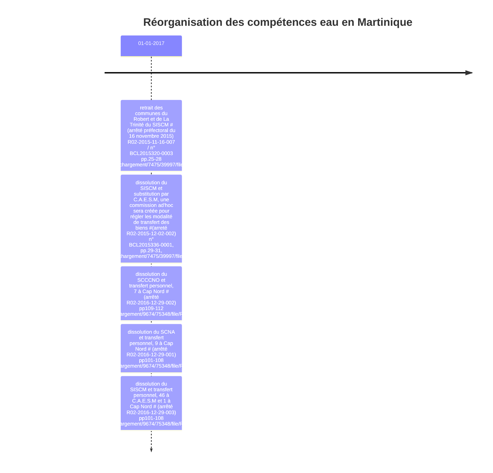

```mermaid
timeline
    title Réorganisation des compétences eau en Martinique
    01-01-2017 : retrait des communes du Robert et de La Trinité du SISCM  # (arrêté préfectoral du 16 novembre 2015) R02-2015-11-16-007 / n° BCL2015320-0003  pp.25-28  https://www.martinique.gouv.fr/contenu/telechargement/7475/39997/file/RAA%20-%20N%C2%B002-2015-014.pdf
               : dissolution du SISCM et substitution par C.A.E.S.M, une commission ad'hoc sera créée pour régler les modalité de transfert des biens #(arreté R02-2015-12-02-002) n° BCL2015336-0001, pp.29-31, https://www.martinique.gouv.fr/contenu/telechargement/7475/39997/file/RAA%20-%20N%C2%B002-2015-014.pdf)
               : dissolution du SCCCNO et transfert personnel, 7 à Cap Nord #  (arrêté R02-2016-12-29-002) pp109-112 https://www.martinique.gouv.fr/contenu/telechargement/9674/75348/file/RAA%20-%20N%C2%B0%2002-2016-134.pdf
               : dissolution du SCNA et transfert personnel, 9 à Cap Nord  # (arrêté R02-2016-12-29-001) pp101-108 https://www.martinique.gouv.fr/contenu/telechargement/9674/75348/file/RAA%20-%20N%C2%B0%2002-2016-134.pdf
               : dissolution du SISCM et transfert personnel, 46 à C.A.E.S.M et 1 à Cap Nord # (arrêté R02-2016-12-29-003)  pp101-108 https://www.martinique.gouv.fr/contenu/telechargement/9674/75348/file/RAA%20-%20N%C2%B0%2002-2016-134.pdf
```
