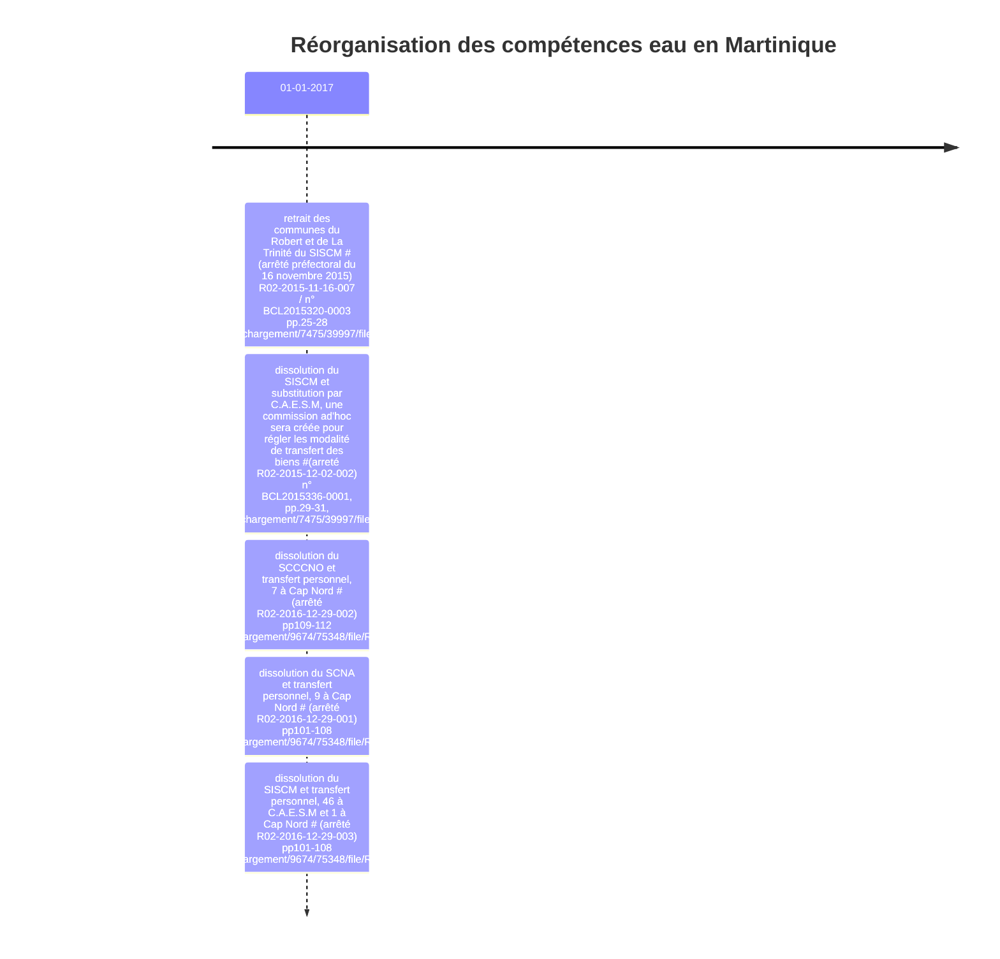
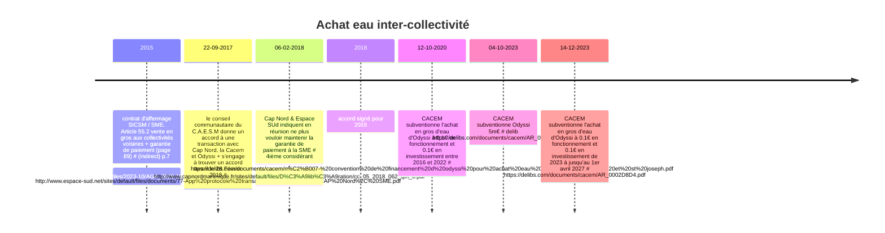

```mermaid
timeline
    title Réorganisation des compétences eau en Martinique

    01-01-2017 : retrait des communes du Robert et de La Trinité du SISCM  # (arrêté préfectoral du 16 novembre 2015) R02-2015-11-16-007 / n° BCL2015320-0003  pp.25-28  https://www.martinique.gouv.fr/contenu/telechargement/7475/39997/file/RAA%20-%20N%C2%B002-2015-014.pdf 
               : dissolution du SISCM et substitution par C.A.E.S.M, une commission ad'hoc sera créée pour régler les modalité de transfert des biens #(arreté R02-2015-12-02-002) n° BCL2015336-0001, pp.29-31, https://www.martinique.gouv.fr/contenu/telechargement/7475/39997/file/RAA%20-%20N%C2%B002-2015-014.pdf)
               : dissolution du SCCCNO et transfert personnel, 7 à Cap Nord #  (arrêté R02-2016-12-29-002) pp109-112 https://www.martinique.gouv.fr/contenu/telechargement/9674/75348/file/RAA%20-%20N%C2%B0%2002-2016-134.pdf
               : dissolution du SCNA et transfert personnel, 9 à Cap Nord  # (arrêté R02-2016-12-29-001) pp101-108 https://www.martinique.gouv.fr/contenu/telechargement/9674/75348/file/RAA%20-%20N%C2%B0%2002-2016-134.pdf
               : dissolution du SISCM et transfert personnel, 46 à C.A.E.S.M et 1 à Cap Nord # (arrêté R02-2016-12-29-003)  pp101-108 https://www.martinique.gouv.fr/contenu/telechargement/9674/75348/file/RAA%20-%20N%C2%B0%2002-2016-134.pdf

```

To be separated ?

```mermaid
timeline
    title Achat eau inter-collectivité  
    2015 : contrat d'affermage SICSM / SME. Article  55.2 vente en gros aux collectivités voisines + garantie de paiement (page 89) # (indirect) p.7 : https://www.ccomptes.fr/sites/default/files/2023-10/AGA_2018-186-CAP-Nord-Martinique-CA-2017.pdf
    22-09-2017 : le conseil communautaire du C.A.E.S.M donne un accord à une transaction avec Cap Nord, la Cacem et Odyssi + s'engage à trouver un accord avant le 28 Février 2018 # http://www.espace-sud.net/sites/default/files/documents/77-App%20protocole%20transactionnel%20ES%2C%20CAP%20Nord%2C%20SME.pdf
    06-02-2018 : Cap Nord & Espace SUd indiquent en réunion ne plus vouloir maintenir la garantie de paiement à la SME # 4ième considérant : http://www.capnordmartinique.fr/sites/default/files/D%C3%A9lib%C3%A9ration/cc_05_2018_062_tpn_0.pdf
    2018 : accord signé pour 2015
    12-10-2020 : CACEM subventionne l'achat en gros d'eau d'Odyssi à 0.1€ en fonctionnement et 0.1€ en investissement entre 2016 et 2022 # https://delibs.com/documents/cacem/n%C2%B007-%20convention%20de%20financement%20d%20odyssi%20pour%20achat%20eau%20en%20gros%20lamentin%20et%20st%20joseph.pdf
    04-10-2023 : CACEM subventionne Odyssi 5m€ # delib https://delibs.com/documents/cacem/AR_0002D8D4.pdf
    14-12-2023 : CACEM subventionne l'achat en gros d'eau d'Odyssi à 0.1€ en fonctionnement et 0.1€ en investissement de 2023 à jusqu'au 1er avril 2027 # https://delibs.com/documents/cacem/AR_0002D8D4.pdf
   


```
