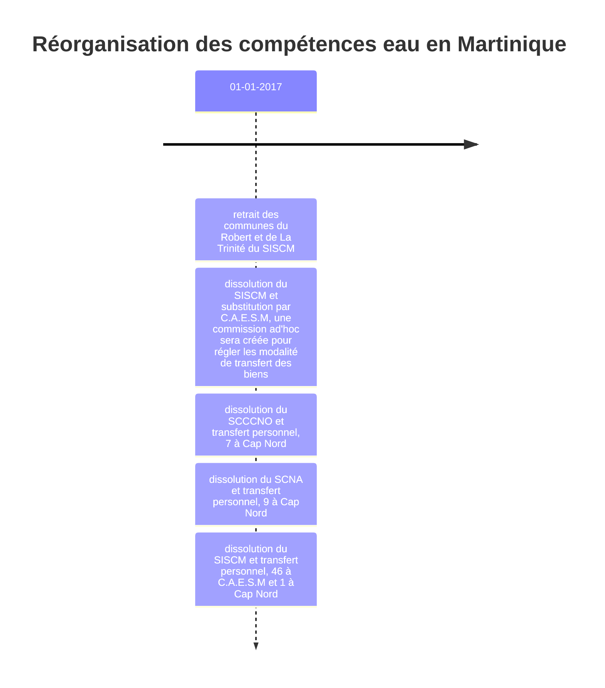

```mermaid
timeline
    title Réorganisation des compétences eau en Martinique

    01-01-2017 : retrait des communes du Robert et de La Trinité du SISCM
               : dissolution du SISCM et substitution par C.A.E.S.M, une commission ad'hoc sera créée pour régler les modalité de transfert des biens 
               : dissolution du SCCCNO et transfert personnel, 7 à Cap Nord 
               : dissolution du SCNA et transfert personnel, 9 à Cap Nord 
               : dissolution du SISCM et transfert personnel, 46 à C.A.E.S.M et 1 à Cap Nord 
```
